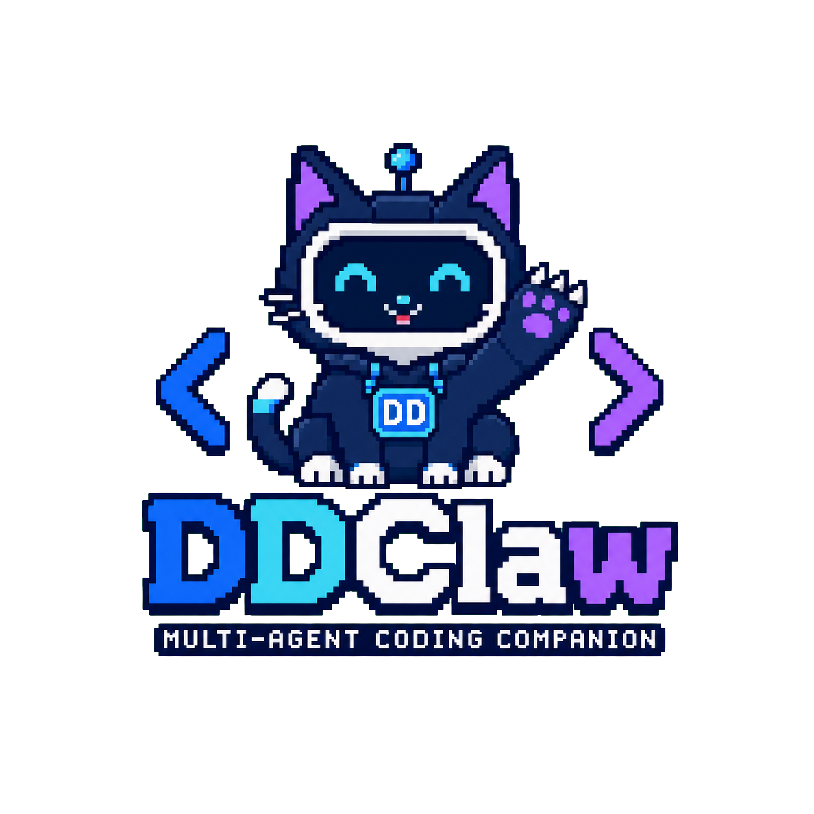
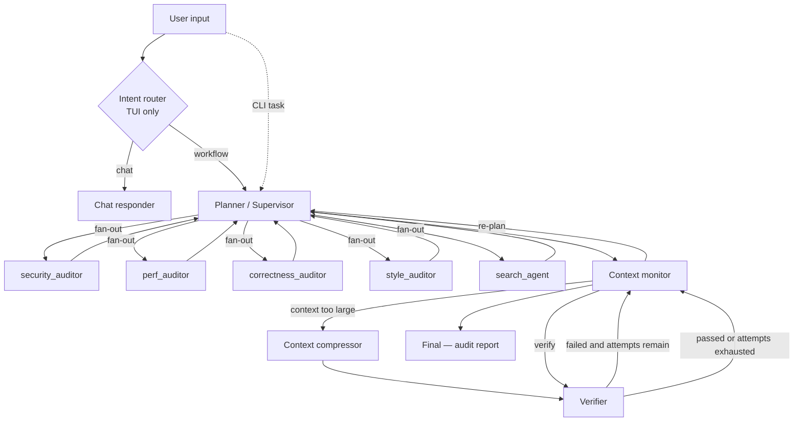

<p align="center">
  
</p>

<p align="center">
  <a href="LICENSE"></a>
</p>

# Audit Agent

Audit Agent 是一个运行在本地终端中的多 Agent 代码审查系统。它以 DeepSeek 为
大语言模型，通过 LangGraph 组织四维度并行审计、对抗验证去误报、上下文压缩和
失败重试，最终生成结构化的代码审查报告。

项目同时提供两种使用方式：

- `audit`：适合脚本化和单次审查任务的 Typer CLI。
- `audit-tui`：支持多轮会话、实时事件流、审批弹窗和动态猫咪 Logo 的
  Textual 终端界面。

> 当前版本：`0.2.0`。项目仍处于早期阶段，建议先在独立 workspace 中使用。

## 核心能力

- **四维度并行审计**：Planner 一次调度，4 个 Auditor（security / perf /
  correctness / style）并行审查，加上 search_agent 进行 CVE 联网检索，
  5 路并发执行。
- **对抗验证去误报**：Verifier 独立审查每条 finding，去重合并 + 对抗质询，
  只保留确认属实的问题，而非全量输出。
- **结构化审查报告**：每条 finding 包含 dimension、severity、file、line、
  title、description、suggestion，最终输出按 critical → low 排序的报告。
- **Human-in-the-loop 审批**：安装依赖、网络下载、开发服务器及破坏性命令
  会根据审批模式放行、询问或拒绝。
- **Workspace 边界保护**：文件工具会解析真实路径和符号链接，拒绝访问
  workspace 之外的路径。
- **断点与恢复**：自动保存状态摘要、工作区清单、Git 快照和恢复说明；
  Ctrl+C 中断后可以继续任务。
- **执行追踪**：记录节点访问、工具调用、审批、Agent 交接、失败次数和时间线。
- **长上下文治理**：运行时组装三层 Memory，并在上下文超限时压缩历史。
- **持久化多轮会话**：TUI 保存最近会话和 workspace 文件摘要，支持连续追问。
- **可选 Web 搜索**：配置 Tavily 后，search_agent 可检索 CVE 和安全最佳实践。

## 工作流架构

TUI 会先判断输入是普通聊天还是需要访问 workspace 的审查任务；CLI 直接进入
任务工作流。



### Planner / Supervisor

Planner 分析用户提交的审查目标，通过 `TodoWriteTool` 发布审查计划、TODO、
验收标准，然后调用 `CallAuditorsTool` 并行调度 4 个 Auditor + search_agent：

- `CallAuditorsTool`：向 4 个 Auditor 分发审查指令（security / perf /
  correctness / style），内部使用 ThreadPoolExecutor 并行执行。
- `CallSearchAgentTool`：委托 CVE 和安全最佳实践检索。

如果 Verifier 发现审查深度不够，Planner 会读取失败原因并下发补充审查指令。

### Auditor（四维度审查 Agent）

每个 Auditor 使用只读工具（file_read + grep + web_search），不修改工作区文件。
审查维度：

| 维度 | 关注点 |
|------|--------|
| **security** | 注入、XSS、认证绕过、硬编码密钥、不安全反序列化、加密弱点 |
| **perf** | N+1 查询、O(n²) 复杂度、缺失索引、无界分配、阻塞 I/O、缓存缺失 |
| **correctness** | 差一错误、空引用、竞态条件、条件反转、缺失错误处理、类型错误 |
| **style** | 命名规范、缺失文档、圈复杂度、死代码、类型注解缺失、不一致格式 |

每个 Auditor 运行 ReAct 循环（最多 5 轮），从模型输出中解析结构化 JSON
findings。

### search_agent

`search_agent` 只使用 Tavily Web 搜索，不编辑文件。它收集查询、答案摘要和
来源 URL，用于补充 CVE 信息和安全最佳实践参考。

### Verifier

Verifier 不只相信 Auditor 的报告。它会：

1. 运行 Planner 给出的验证命令并保存退出码、stdout 和 stderr。
2. 使用只读文件与 Grep 工具检查实际代码。
3. **去重合并**：security 和 correctness 同时报告了同一个问题 → 合并为一条。
4. **对抗验证**：对每条 finding 做 adversarial verify —— "这个告警真的是
   bug 还是误报？"。
5. **排序输出**：confirmed / false_positive / duplicate，按 critical → low
   排列 verified_findings。
6. 审查深度不够时给出下一轮需要补充检查的具体指令。

## 内置工具

| 工具 | 用途 | 写入 workspace |
|---|---|---:|
| `file_read` | 按行读取 UTF-8 文本文件 | 否 |
| `file_write` | 创建或完整覆写文件，自动创建父目录 | 是 |
| `file_edit` | 替换唯一的字面文本片段；零匹配或多匹配会失败 | 是 |
| `grep` | 使用 Python 正则表达式搜索文件，可指定 glob 和结果上限 | 否 |
| `bash` | 在 workspace 作为当前目录执行命令并控制超时 | 视命令而定 |
| `web_search` | 通过 Tavily 搜索公开 Web 并返回来源 | 否 |
| `todo_write` | 发布完整计划、TODO、验收标准和验证命令 | 图状态 |
| `todo_update` | 更新 TODO 的进度、完成或阻塞状态 | 图状态 |

## 环境要求

- Python `3.10+`
- 推荐使用 [uv](https://docs.astral.sh/uv/)
- DeepSeek API Key
- Tavily API Key（仅在需要联网研究时使用）

## 安装

### 使用 uv（推荐）

```bash
git clone https://github.com/NDXXXX/DDclaw.git
cd DDclaw

uv sync --extra dev
cp .env.example .env
```

### 使用 pip

```bash
git clone https://github.com/NDXXXX/DDclaw.git
cd DDclaw

python -m venv .venv
source .venv/bin/activate
python -m pip install -e ".[dev]"
cp .env.example .env
```

Windows PowerShell 激活虚拟环境时使用：

```powershell
.venv\Scripts\Activate.ps1
```

## 配置模型与搜索

编辑仓库根目录的 `.env`：

```dotenv
DEEPSEEK_API_KEY=your-real-deepseek-api-key
DEEPSEEK_API_BASE=https://api.deepseek.com
DEEPSEEK_MODEL=deepseek-v4-flash

# 可选：只有 Web 搜索需要
TAVILY_API_KEY=your-real-tavily-api-key
```

注意：

- `.env` 已加入 `.gitignore`，不要将真实密钥提交到 Git。
- `.env.example` 只能保存占位符。
- 没有 `DEEPSEEK_API_KEY` 时，模型工厂会直接报错。
- 没有 `TAVILY_API_KEY` 时，普通审查任务仍可运行；Web 搜索会返回
  `missing TAVILY_API_KEY`。

## CLI 使用

完成依赖同步后运行：

```bash
uv run --no-sync audit \
  "审查 src/ 目录的安全性" \
  --workspace ./workspace
```

也可以在激活虚拟环境后直接使用：

```bash
audit "审查 app.py 的性能问题" -w ./workspace
```

如果不指定 `--workspace`，Audit Agent 会在当前目录自动创建并使用：

```text
.audit-workspace/
```

### 常用参数

| 参数 | 默认值 | 说明 |
|---|---:|---|
| `task` | 无 | 要审查的任务；使用 `--resume` 时可以省略 |
| `--workspace`, `-w` | `.audit-workspace` | Agent 唯一允许操作的工作区 |
| `--max-attempts` | `3` | Planner → Verifier 最大尝试次数 |
| `--approval-mode` | `inline` | `inline`、`auto` 或 `deny` |
| `--checkpoint-mode` | `light` | `light`、`strict` 或 `off` |
| `--trace-mode` | `on` | `on` 或 `off` |
| `--resume` | 无 | 从指定 workspace 的检查点恢复 |

查看完整帮助：

```bash
uv run --no-sync audit --help
python -m audit_agent --help
```

## TUI 使用

```bash
uv run --no-sync audit-tui
```

TUI 默认使用当前目录下的 `.audit-workspace`，支持：

- 多轮输入与会话上下文。
- Plan 面板和实时工具事件流。
- Planner → Auditor 交接信息。
- 风险命令审批弹窗。
- Checkpoint 与最终审查报告。
- 猫咪 Logo 的启动动画和工作流状态动画。

快捷键：

| 快捷键 | 功能 |
|---|---|
| `Ctrl+C` | 退出（VS Code 集成终端推荐） |
| `Ctrl+Q` | 退出；可能被 VS Code 占用 |
| `F10` | 退出备用键 |
| `Ctrl+L` | 清空事件面板 |
| `Y` / `Enter` | 在审批弹窗中批准 |
| `N` / `Escape` | 在审批弹窗中拒绝 |

## 命令审批

以下类型的 Bash 命令会被标记为风险操作：

- Python、Node.js 依赖安装或同步，例如 `pip install`、`uv add`、
  `uv sync`、`npm install`。
- 可能隐式同步依赖的 `uv run`（带 `--no-sync` 时不会触发这一项）。
- `curl`、`wget` 等网络下载。
- `uvicorn`、`python -m http.server` 等长时间运行的开发服务器。
- `rm -rf`、`git clean`、`git reset --hard` 等破坏性操作。

审批模式：

| 模式 | 行为 |
|---|---|
| `inline` | CLI/TUI 询问用户后再决定是否执行 |
| `auto` | 自动批准，并在结果和 Trace 中保留审批标记 |
| `deny` | 直接拒绝所有风险命令 |

同一次 Planner/Verifier 尝试中，等价命令会复用审批决定；进入下一次尝试后
才会重新询问。破坏性删除命令如果包含绝对路径、`~` 或父目录 `..`，即使
使用 `auto` 也会被拒绝。

## Checkpoint 与恢复

Audit Agent 将运行数据保存在 workspace 内的 `.audit/`，不会写入项目源码目录，
除非源码目录本身就是你指定的 workspace。

Checkpoint 模式：

| 模式 | 保存内容 |
|---|---|
| `light` | `checkpoint.json`、`RECOVERY.md`、文件清单和工作区 Git 快照 |
| `strict` | 在 light 基础上增加完整 `state.json` 与逐事件 `events.jsonl` |
| `off` | 不创建 Checkpoint |

被 Ctrl+C 中断时，Audit Agent 会先将 Checkpoint 原子更新为 `interrupted`，结束
Trace，并终止仍在运行的 Bash 进程组。恢复命令：

```bash
uv run --no-sync audit --resume ./workspace
```

恢复时会重建图输入，并根据上次保存的状态重新规划未完成工作。若检测到同一
workspace 仍有活动进程，Audit Agent 会拒绝并发恢复。

## Trace

启用 Trace 后，每次运行会创建独立目录：

```text
workspace/.audit/traces/<trace-id>/
├── trace.json
├── events.jsonl
└── timeline.md
```

- `trace.json`：运行状态、耗时、节点访问次数、工具与审批统计。
- `events.jsonl`：按时间顺序记录事件。
- `timeline.md`：适合人工阅读的时间线摘要。

Trace 与 Checkpoint 互相独立；Trace 渲染失败不会把已经写入的终态
Checkpoint 改回 `running`。

## Session 与三层 Memory

TUI 会在 workspace 中保存：

```text
workspace/.audit/session/
├── session.json
└── SESSION_SUMMARY.md
```

每次输入都会获得会话编号和 turn 编号。下一个 turn 可以看到最近对话摘要与
最近修改的 workspace 文件，但上下文长度会受到限制。

Agent 每次调用前由运行时组装三层 Memory：

1. **Rules Layer**：固定的 workspace 和持久化规则。
2. **Working Memory**：任务、计划、TODO、验收标准、审查发现（review_findings）、
   Agent 交接、最近失败和尝试次数。
3. **History Summary Store**：压缩历史、`HISTORY_SUMMARY.md`、可选的
   `NOTEPAD.md` 和最近压缩事件。

Context Monitor 默认在估算上下文超过 `400,000` tokens 时进入
Context Compressor。压缩后的摘要会替换冗长消息历史并写入
`HISTORY_SUMMARY.md`，然后回到原定的 Planner 或 Verifier 节点继续工作。

## Workspace 文件结构

一次运行后，workspace 可能类似：

```text
workspace/
├── .audit/
│   ├── checkpoints/
│   │   ├── checkpoint.json
│   │   ├── RECOVERY.md
│   │   ├── state.json          # strict 模式
│   │   ├── events.jsonl        # strict 模式
│   │   └── workspace.git/
│   ├── session/                # TUI 多轮会话
│   └── traces/
├── HISTORY_SUMMARY.md          # 发生上下文压缩时生成
└── ...                         # Agent 创建或修改的任务文件
```

`.venv`、`node_modules`、`__pycache__` 和常见测试缓存不会进入工作区清单或
Checkpoint Git 快照。

## 安全边界

Audit Agent 提供的是应用层防护，不是完整安全沙箱：

- 文件工具拒绝解析到 workspace 之外的路径，包括符号链接逃逸。
- Bash 以 workspace 作为当前目录，并提供超时和风险审批。
- Bash 命令仍由本机操作系统 Shell 执行，理论上可以访问当前用户有权限访问的
  其他资源。
- 不要在不可信任务、敏感主目录或包含重要未备份数据的 workspace 中使用
  `--approval-mode auto`。
- 推荐为每个任务创建独立目录，并在批准命令前阅读完整命令文本。

## 项目结构

```text
src/audit_agent/
├── agents/
│   ├── auditor.py               # 四维度审查 Agent（security / perf / correctness / style）
│   └── search_agent.py          # Tavily 搜索 Agent
├── cli/
│   ├── app.py                   # Typer CLI
│   └── tui/
│       ├── app.py               # Textual 多轮 TUI
│       ├── approval.py          # 审批弹窗与线程同步
│       └── logo.py              # 动态猫咪 Logo
├── core/
│   ├── agent.py                 # 工作流事件流、Checkpoint 与 Trace 协调
│   ├── approval.py              # 风险分类与审批状态
│   ├── checkpoint.py            # 保存、Git 快照和恢复
│   ├── paths.py                 # workspace 路径安全
│   ├── session.py               # 多轮会话持久化
│   ├── state.py                 # RuntimeState
│   └── trace.py                 # 执行追踪
├── graph/
│   ├── memory.py                # 三层 Memory
│   ├── nodes.py                 # Planner、Auditors、Verifier、Context 等节点
│   ├── state.py                 # LangGraph 共享状态（AuditGraphState）
│   └── workflow.py              # 入口图和主工作流图
├── prompts/                     # 各阶段 System Prompt
├── providers/
│   └── deepseek_provider.py     # ChatDeepSeek 工厂
└── tools/                       # 文件、Grep、Bash、Todo 与 Web 搜索工具
```

## 开发与测试

安装开发依赖：

```bash
uv sync --extra dev
```

运行全部测试：

```bash
uv run --no-sync pytest -q
```

当前测试覆盖 CLI、TUI、文件与路径安全、审批、Checkpoint、Trace、Session、
Memory、图节点、工作流、Auditor、DeepSeek Provider、Web Search Agent、
Tool Execution、Todo Tools 与端到端 Smoke Test。

也可以分别验证入口：

```bash
uv run --no-sync audit --help
uv run --no-sync python -m audit_agent --help
```

## 当前限制

- 当前 Provider 只接入 DeepSeek。
- Web 搜索依赖 Tavily，未配置 Key 时不可用。
- CLI 是单任务入口；多轮聊天和意图路由主要通过 TUI 使用。
- 模型输出存在不确定性，关键结果应以 Verifier、实际文件和命令结果为准。
- BashTool 不是容器或虚拟机级沙箱。

## License

本项目采用 [MIT License](LICENSE) 开源，版权所有 © 2026 NDXXXX。

## 🙏 致谢

[**Textual**](https://github.com/Textualize/textual) — **TUI 架构**
